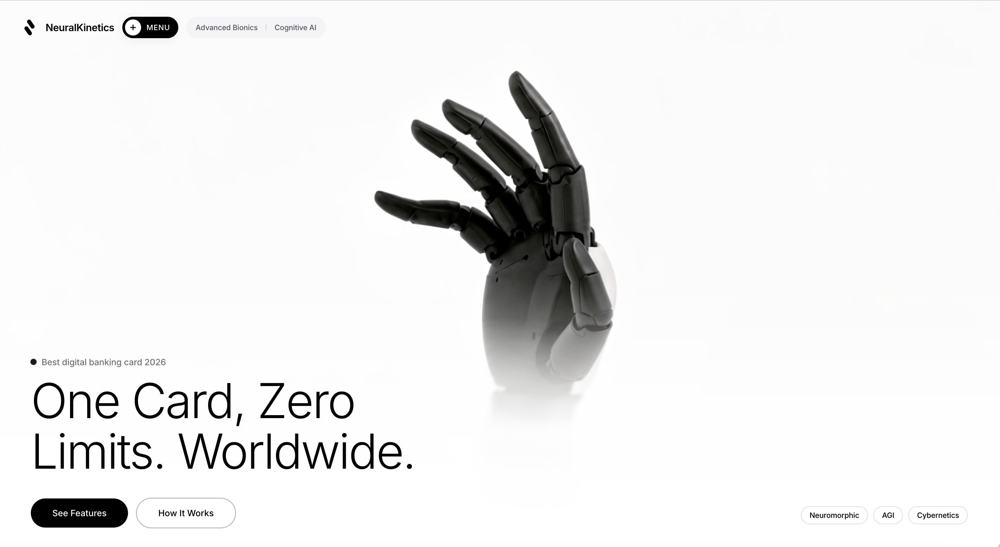

# Awesome Web Prompts

> 收集互联网上优质的网页开发资源，包括 AI 提示词和现成可用的网页代码。

[](https://awesome.re)

[English](README_EN.md) | 中文

## 简介

这是一个精心整理的网页开发资源合集，收录两类内容：

- **Prompt** — 用于 AI 工具（ChatGPT、Claude、Cursor 等）的提示词，粘贴即可生成完整网页代码
- **Source Code** — 现成可运行的网页代码，直接使用或作为二次开发的起点

每个条目都附有效果截图和使用说明。

## 目录

### Hero Section

首屏主视觉区域，通常包含标题、副标题、CTA 按钮和背景视觉效果。

| 名称 | 类型 | 说明 | 预览 |
|------|------|------|------|
| [Interactive Discovery](prompts/hero/interactive-discovery/) | Prompt | 光标跟随聚光灯揭示双层图片，地质品牌全屏暗色 Hero |  |
| [Bold Studio](prompts/hero/bold-studio/) | Prompt | 全屏视频背景 + 冲击性三行标题 + 统计数字，创意机构品牌落地页 |  |
| [TechForward](prompts/hero/techforward/) | Prompt | 极简黑白全屏视频 + Framer Motion 动画 + 纯 CSS，神经科技品牌风格 |  |

### Landing Page

完整的落地页，包含多个区块的整页设计。

| 名称 | 类型 | 说明 | 预览 |
|------|------|------|------|
| [3D Story](prompts/landing-page/3d-story/) | Source Code | 滚动驱动视频帧逐帧播放 + 粒子系统 + 卡片渐进揭示，沉浸式 3D 框架营销页 |  |

## 项目结构

```
awesome-web-prompts/
├── README.md                 # 中文主页
├── README_EN.md              # English version
├── CONTRIBUTING.md           # 贡献指南
└── prompts/                  # 所有收录内容
    ├── _template/            # 模板（新建条目时复制此目录）
    │   ├── README.md         # 效果图 + 说明
    │   └── prompt.md         # 提示词或代码原文
    ├── hero/                 # Hero Section 类
    │   └── 项目名/
    │       ├── README.md
    │       ├── prompt.md
    │       └── image.png
    └── landing-page/         # Landing Page 类
        └── 项目名/
            ├── README.md
            ├── prompt.md
            └── image.png
```

## 如何使用

**Prompt 类型：**
1. 打开 `prompt.md` 复制提示词
2. 粘贴到 ChatGPT、Claude、Cursor 等 AI 工具中生成代码

**Source Code 类型：**
1. 打开 `prompt.md` 复制完整代码
2. 保存为对应文件格式，直接在浏览器运行，或作为二次开发的起点

## 贡献

欢迎提交你发现的优质资源！请查看 [贡献指南](CONTRIBUTING.md) 了解如何参与。

## License

[MIT](LICENSE)
