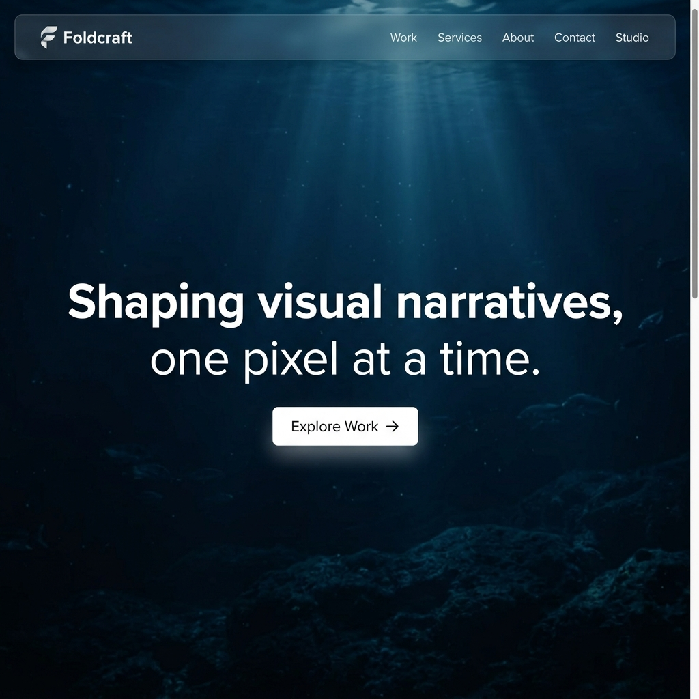
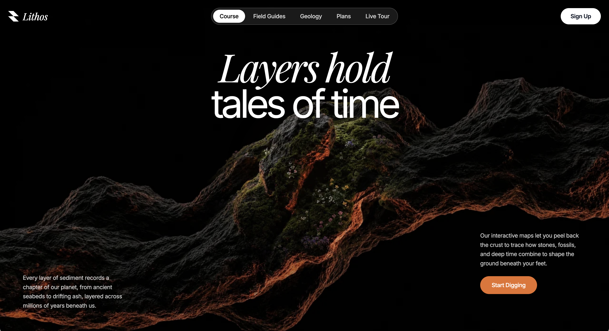
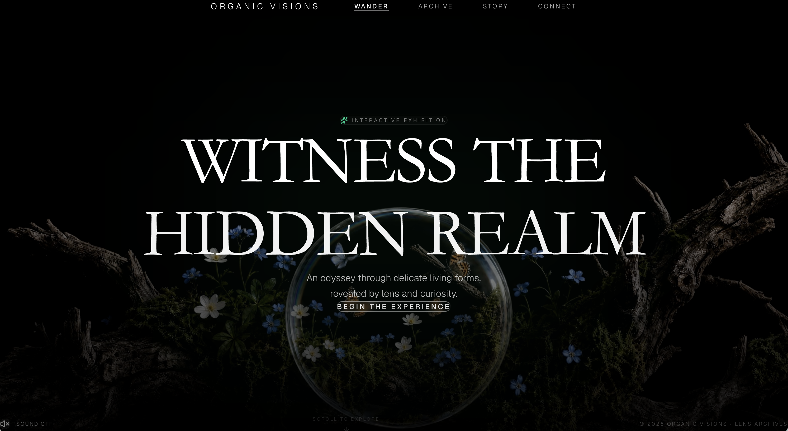
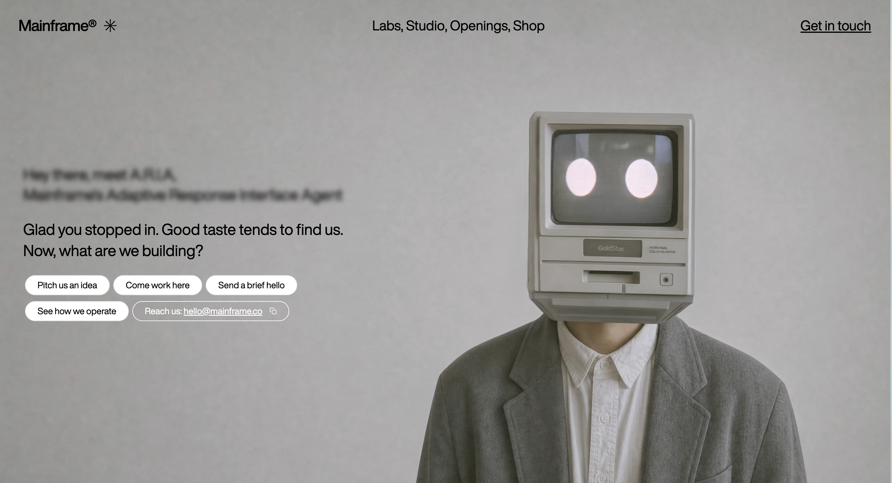
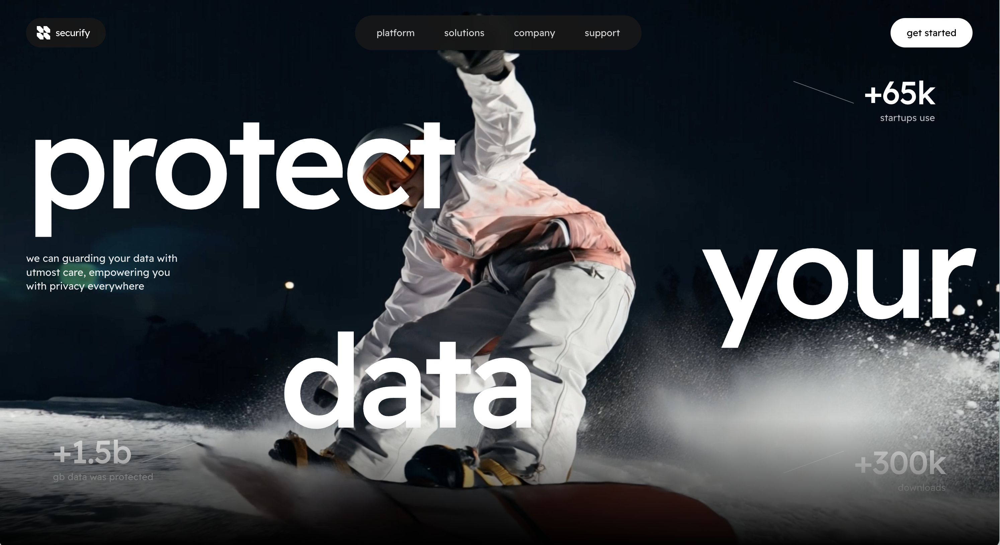
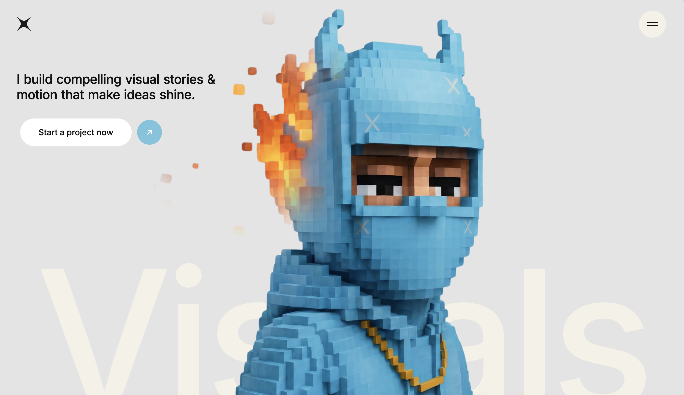
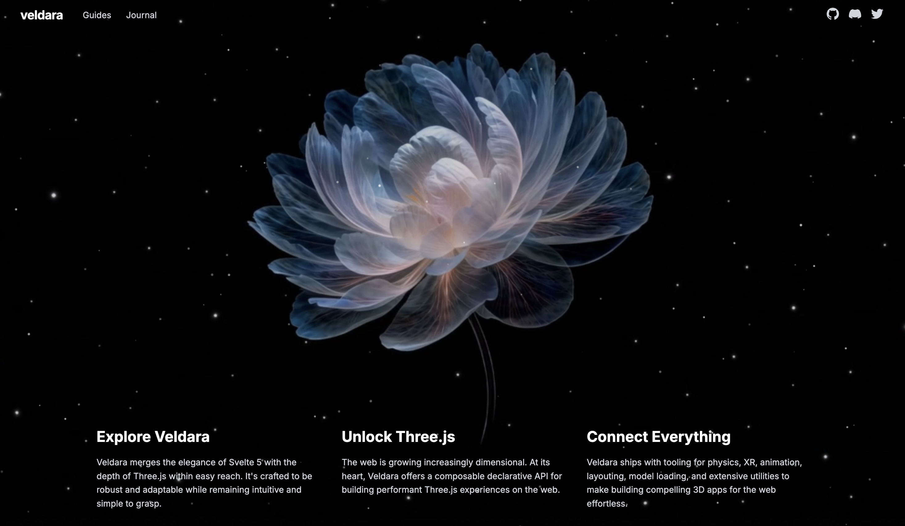
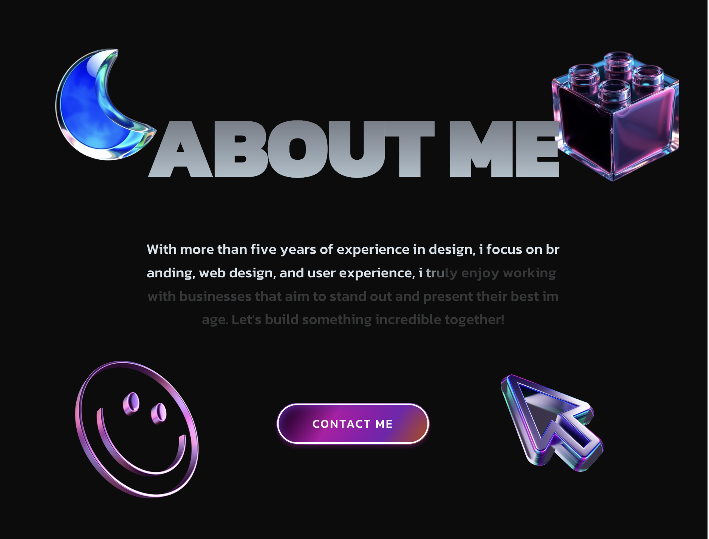

# Awesome Web Prompts

> A curated collection of web development resources — AI prompts and ready-to-use source code for building beautiful web pages.

[](https://awesome.re)

[中文](README.md) | English

## About

A carefully curated collection of web development resources in two formats:

- **Prompt** — Instructions for AI tools (ChatGPT, Claude, Cursor, etc.) that generate complete web page code when pasted
- **Source Code** — Ready-to-run web code you can use directly or as a starting point for further development

Every entry includes a preview screenshot and usage notes.

## Index

### Hero Section

The first viewport-height section of a page, typically featuring a headline, subheadline, CTA buttons, and a strong visual background.

| Name | Type | Description | Preview |
|------|------|-------------|---------|
| [Bio-Age Dashboard](prompts/sections/hero/bio-age-dashboard/) | Prompt | Slow rotating aura + infinite ticker ruler + expandable hover cards; health data dashboard hero |  |
| [Bold Studio](prompts/sections/hero/bold-studio/) | Prompt | Full-screen video bg + three-line impact headline + stat counters; creative agency landing |  |
| [Contact Cybernetic](prompts/sections/hero/contact-cybernetic/) | Prompt | Mouse-scrub video interaction + spring-animated multi-select pills; cybernetic contact hero | - |
| [CozyPaws](prompts/sections/hero/cozy-paws/) | Prompt | Bouncy overshoot word pop animation + responsive 3-panel footer image parallax, cozy pet store hero | - |
| [Creative Portfolio](prompts/sections/hero/creative-portfolio/) | Prompt | 3-video crossfade switcher + precise responsive typography; personal creative hero |  |
| [Immersive Ocean](prompts/sections/hero/immersive-ocean/) | Prompt | Cinematic deep ocean video background + responsive collapsible nav + staggered fade-up text animations; Foldcraft studio hero |  |
| [IntelligentX](prompts/sections/hero/intelligent-x/) | Prompt | Giant typography mixed with inline pill visual elements + deep masked video, minimalist glassmorphic medical hero | - |
| [Interactive Discovery](prompts/sections/hero/interactive-discovery/) | Prompt | Cursor-following spotlight reveals a second image; dark geology brand hero |  |
| [Luxury Hero](prompts/sections/hero/luxury-hero/) | Prompt | Scroll-scrubbed background video + GSAP parallax glass panel; luxury experience hero |  |
| [Organic Odyssey](prompts/sections/hero/organic-odyssey/) | Prompt | Cinematic microscopic background + precise liquid glass button; nature aesthetic hero |  |
| [Portal](prompts/sections/hero/portal/) | Prompt | CSS Mask bottom blur fade + Liquid Glass + 10-level staggered entrance, cinematic full-screen hero | - |
| [Retro-Futurist](prompts/sections/hero/retro-futurist/) | Prompt | Mouse-scrub interactive video background + custom typewriter effect; retro-futurist agency hero |  |
| [Securify Data Security](prompts/sections/hero/securify-data-security/) | Prompt | Giant staggered typography + floating stats + background video; data security SaaS hero |  |
| [Stillmind](prompts/sections/hero/stillmind/) | Prompt | 4-video switcher + Liquid Glass UI + floating PNG overlay; mindfulness app fullscreen hero |  |
| [TechForward](prompts/sections/hero/techforward/) | Prompt | Minimal black-and-white video hero + Framer Motion animations + plain CSS; neuro-tech brand |  |
| [VEX Venture](prompts/sections/hero/vex-venture/) | Prompt | Minimalist venture hero page; raw video background + precise native staggered animations |  |
| [Vision Reveal](prompts/sections/hero/vision-reveal/) | Source Code | Tile split entrance + cursor spotlight reveal; pure HTML/CSS/JS creative studio hero |  |
| [Wellbeing OS](prompts/sections/hero/wellbeing-os/) | Prompt | High-end Liquid Glass borders + responsive hover-triggered dropdown menu + smooth sliding mobile drawer, flowpath wellness SaaS hero | - |
| [Wellness Balance](prompts/sections/hero/wellness-balance/) | Prompt | Word-by-word reveal typography + asymmetric grid footer with auto-carousel, minimalist wellness supplement hero | - |
| [Wellness Devicex](prompts/sections/hero/wellness-devicex/) | Prompt | 5-layer Z-index architecture + Canvas dynamic spotlight video mask, cinematic dark mode wearable hero | - |

### Landing Page

Full multi-section pages covering hero, features, testimonials, pricing, and footer.

| Name | Type | Description | Preview |
|------|------|-------------|---------|
| [3D Story](prompts/pages/landing-page/3d-story/) | Source Code | Scroll-driven video frame scrubbing + particle system + card reveal; immersive 3D framework marketing page |  |
| [AI Designer Portfolio](prompts/pages/landing-page/ai-designer-portfolio/) | Prompt | Mouse-trail GIF particles + parallax image + auto-scrolling testimonial carousel; designer portfolio landing | - |
| [Health Portal](prompts/pages/landing-page/health-portal/) | Prompt | Masked cards mosaic effect + staggered reveals; single-page dental medical landing page |  |
| [Innovation](prompts/pages/landing-page/innovation/) | Prompt | Advanced liquid glass + vanilla JS seamless video crossfade to black; 5-section enterprise landing page | - |
| [Orbis NFT](prompts/pages/landing-page/orbis-nft/) | Prompt | Advanced liquid glass effect + global texture overlay + deep space video grid, dark mode NFT landing page | - |
| [Prisma Creative Studio](prompts/pages/landing-page/prisma-creative-studio/) | Prompt | Cinematic dark mode + SVG noise background + words pull-up animation; 3-section creative studio landing page |  |
| [SkyElite Private Jets](prompts/pages/landing-page/skyelite-private-jets/) | Prompt | Premium private jet landing page with video background and overlapping typography | - |
| [USD Halo](prompts/pages/landing-page/usd-halo/) | Prompt | Fintech stablecoin landing page, rounded video Hero + brand font marquee | - |

### Auth & Onboarding

Authentication, sign-up, and user onboarding pages.

| Name | Type | Description | Preview |
|------|------|-------------|---------|
| [Aurora Onboard](prompts/pages/auth/aurora-onboard/) | Prompt | Split-screen layout + unmasked pure video hero + staggered entrance animations, minimalist B&W sign up | - |

### 404 Pages

Custom error guidance and 404 not found pages.

| Name | Type | Description | Preview |
|------|------|-------------|---------|
| [404 Planet](prompts/pages/404/404-planet/) | Prompt | Locked 100vh cloud hosting error page with looping video background, liquid glass button, and glowing 404 text |  |
| [Fun 404 Page](prompts/pages/404/fun-404-page/) | Prompt | Dynamically scaled giant background text + handcrafted staggered drawer menu, bright children's brand 404 | - |
| [Nexto 404](prompts/pages/404/nexto-404/) | Prompt | Locked 100vh viewport + layered spaceship background + slow float animation, sci-fi error page | - |

### Footer Section

Modern footer navigation sections and Call-to-Action (CTA) components.

| Name | Type | Description | Preview |
|------|------|-------------|---------|
| [Tenlas Footer](prompts/sections/footer/tenlas-footer/) | Prompt | Dark mode CTA + premium footer with staggered fade-up animations and responsive flush SVG brand text |  |

### UI Components

Standalone UI components, 3D interactive visuals, and card carousels.

| Name | Type | Description | Preview |
|------|------|-------------|---------|
| [Animated Cards](prompts/components/animated-cards/) | Prompt | 3D horizontal cylinder card carousel with mouse parallax tilt, volumetric thickness layers, and dual-face flip |  |

### Portfolio

Personal portfolio pages focused on showcasing past work and skills.

| Name | Type | Description | Preview |
|------|------|-------------|---------|
| [3D Portfolio](prompts/pages/portfolio/3d-portfolio/) | Prompt | 3D creator portfolio with magnetic hover, infinite marquee, and sticky stacking cards |  |
| [Portfolio Cosmic](prompts/pages/portfolio/portfolio-cosmic/) | Prompt | Premium dark portfolio with HLS background and complex GSAP scroll parallax | - |

### Fintech

Financial technology pages, including mobile app mockups, payment flows, and digital asset product pages.

| Name | Type | Description | Preview |
|------|------|-------------|---------|
| [Remit Race](prompts/pages/fintech/remit-race/) | Prompt | Dark competition-style mobile mockup with 3D globe video + layered countdown bar | - |

### Contact Pages

Contact forms and landing pages focused on input validation, custom tags, and interactive submit states.

| Name | Type | Description | Preview |
|------|------|-------------|---------|
| [Build With Us](prompts/sections/contact/build-with-us/) | Prompt | Full-screen video background + physical card layout + service tags multi-select + submit success state transition | - |

## Structure

```
awesome-web-prompts/
├── README.md                 # 中文主页 (Auto-built)
├── README_EN.md              # English version (Auto-built)
├── DESIGN.md                 # Machine-readable Design System
├── CONTRIBUTING.md           # Contribution Guidelines
├── package.json              # Scripts & Tooling
├── scripts/                  # Automation scripts
└── prompts/                  # Prompt Repository
    ├── _template/            # Template (with meta.json)
    ├── pages/                # 1. Full Pages (Landing Page, 404, Auth, Portfolio, Fintech)
    ├── sections/             # 2. Page Sections (Hero, Footer, Contact)
    └── components/           # 3. UI Components & Visuals (Animated Cards)
```

## How to Use

**Prompt entries:**
1. Open `prompt.md` and copy the prompt text
2. Paste it into ChatGPT, Claude, Cursor, or any AI coding tool to generate the code

**Source Code entries:**
1. Open `prompt.md` and copy the complete code
2. Save it in the appropriate file format and open it in a browser, or use it as a starting point for your own project

## Contributing

Contributions are welcome! See [CONTRIBUTING.md](CONTRIBUTING.md) for details on how to add a new entry.

## Star History

[](https://star-history.com/#DexZane/awesome-web-prompts&Date)

## License

[MIT](LICENSE)
