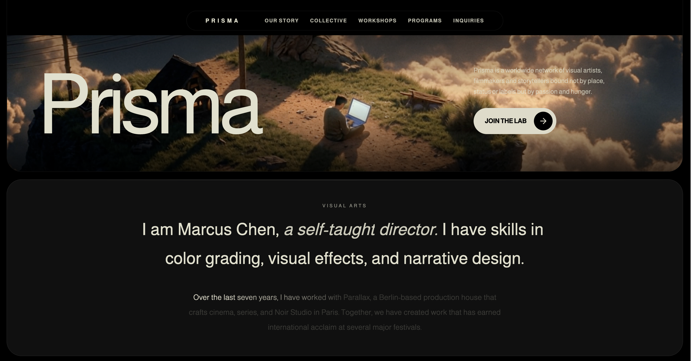
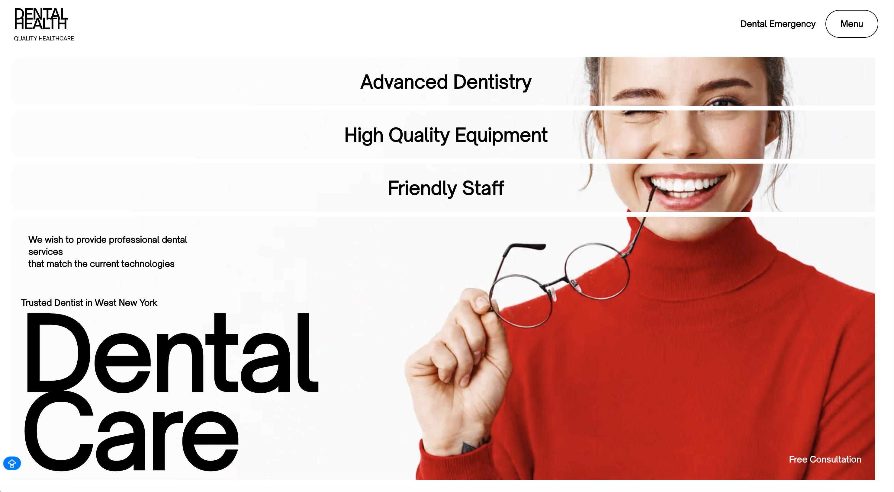

# Awesome Web Prompts

> A curated collection of web development resources — AI prompts and ready-to-use source code for building beautiful web pages.

[](https://awesome.re)

[中文](README.md) | English

## About

A carefully curated collection of web development resources in two formats:

- **Prompt** — Instructions for AI tools (ChatGPT, Claude, Cursor, etc.) that generate complete web page code when pasted
- **Source Code** — Ready-to-run web code you can use directly or as a starting point for further development

Every entry includes a preview screenshot and usage notes.

## Index

### Hero Section

The first viewport-height section of a page, typically featuring a headline, subheadline, CTA buttons, and a strong visual background.

| Name | Type | Description | Preview |
|------|------|-------------|---------|
| [Interactive Discovery](prompts/hero/interactive-discovery/) | Prompt | Cursor-following spotlight reveals a second image; dark geology brand hero |  |
| [Bold Studio](prompts/hero/bold-studio/) | Prompt | Full-screen video bg + three-line impact headline + stat counters; creative agency landing |  |
| [TechForward](prompts/hero/techforward/) | Prompt | Minimal black-and-white video hero + Framer Motion animations + plain CSS; neuro-tech brand |  |
| [Stillmind](prompts/hero/stillmind/) | Prompt | 4-video switcher + Liquid Glass UI + floating PNG overlay; mindfulness app fullscreen hero |  |
| [Vision Reveal](prompts/hero/vision-reveal/) | Source Code | Tile split entrance + cursor spotlight reveal; pure HTML/CSS/JS creative studio hero |  |
| [Luxury Hero](prompts/hero/luxury-hero/) | Prompt | Scroll-scrubbed background video + GSAP parallax glass panel; luxury experience hero |  |
| [Bio-Age Dashboard](prompts/hero/bio-age-dashboard/) | Prompt | Slow rotating aura + infinite ticker ruler + expandable hover cards; health data dashboard hero |  |
| [Creative Portfolio](prompts/hero/creative-portfolio/) | Prompt | 3-video crossfade switcher + precise responsive typography; personal creative hero |  |
| [Organic Odyssey](prompts/hero/organic-odyssey/) | Prompt | Cinematic microscopic background + precise liquid glass button; nature aesthetic hero |  |
| [VEX Venture](prompts/hero/vex-venture/) | Prompt | Minimalist venture hero page; raw video background + precise native staggered animations | - |
| [Retro-Futurist](prompts/hero/retro-futurist/) | Prompt | Mouse-scrub interactive video background + custom typewriter effect; retro-futurist agency hero | - |
| [Securify Data Security](prompts/hero/securify-data-security/) | Prompt | Giant staggered typography + floating stats + background video; data security SaaS hero | - |
| [Contact Cybernetic](prompts/hero/contact-cybernetic/) | Prompt | Mouse-scrub video interaction + spring-animated multi-select pills; cybernetic contact hero | - |

### Landing Page

Full multi-section pages covering hero, features, testimonials, pricing, and footer.

| Name | Type | Description | Preview |
|------|------|-------------|---------|
| [3D Story](prompts/landing-page/3d-story/) | Source Code | Scroll-driven video frame scrubbing + particle system + card reveal; immersive 3D framework marketing page |  |
| [Prisma Creative Studio](prompts/landing-page/prisma-creative-studio/) | Prompt | Cinematic dark mode + SVG noise background + words pull-up animation; 3-section creative studio landing page |  |
| [Health Portal](prompts/landing-page/health-portal/) | Prompt | Masked cards mosaic effect + staggered reveals; single-page dental medical landing page |  |
| [Innovation](prompts/landing-page/innovation/) | Prompt | Advanced liquid glass + vanilla JS seamless video crossfade to black; 5-section enterprise landing page | - |
| [SkyElite Private Jets](prompts/landing-page/skyelite-private-jets/) | Prompt | Premium private jet landing page with video background and overlapping typography | - |

### Portfolio

Personal portfolio pages focused on showcasing past work and skills.

| Name | Type | Description | Preview |
|------|------|-------------|---------|
| [3D Portfolio](prompts/portfolio/3d-portfolio/) | Prompt | 3D creator portfolio with magnetic hover, infinite marquee, and sticky stacking cards |  |
| [Portfolio Cosmic](prompts/portfolio/portfolio-cosmic/) | Prompt | Premium dark portfolio with HLS background and complex GSAP scroll parallax | - |

## Structure

```
awesome-web-prompts/
├── README.md                 # Chinese homepage
├── README_EN.md              # English homepage (this file)
├── CONTRIBUTING.md           # Contribution guide
└── prompts/                  # All entries
    ├── _template/            # Template — copy this when adding a new entry
    │   ├── README.md         # Preview + description
    │   └── prompt.md         # Prompt text or source code
    ├── hero/                 # Hero Section entries
    │   └── project-name/
    │       ├── README.md
    │       ├── prompt.md
    │       └── image.png
    └── landing-page/         # Landing Page entries
        └── project-name/
            ├── README.md
            ├── prompt.md
            └── image.png
    └── portfolio/            # Portfolio entries
        └── project-name/
            ├── README.md
            ├── prompt.md
            └── image.png
```

## How to Use

**Prompt entries:**
1. Open `prompt.md` and copy the prompt text
2. Paste it into ChatGPT, Claude, Cursor, or any AI coding tool to generate the code

**Source Code entries:**
1. Open `prompt.md` and copy the complete code
2. Save it in the appropriate file format and open it in a browser, or use it as a starting point for your own project

## Contributing

Contributions are welcome! See [CONTRIBUTING.md](CONTRIBUTING.md) for details on how to add a new entry.

## License

[MIT](LICENSE)
