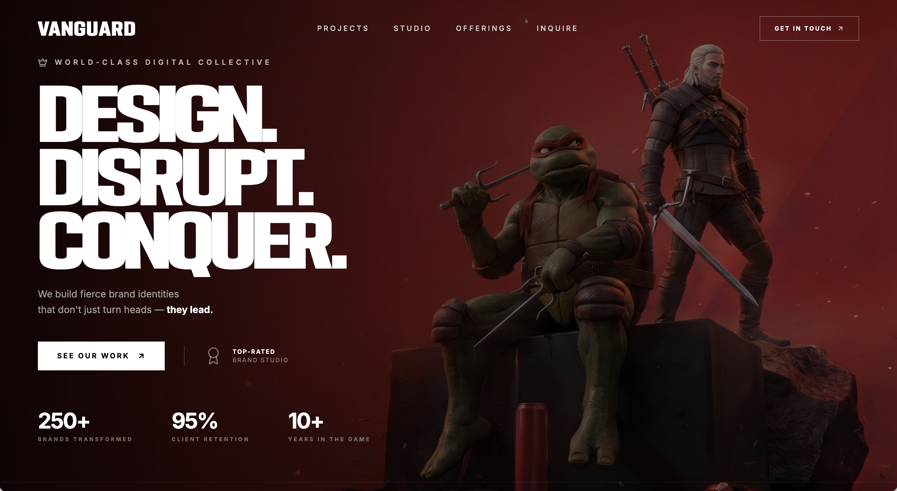

# Bold Studio

> 全屏视频背景 Hero，配合粗犷有力的展示字体和统计数字，适合创意代理公司品牌落地页。

## 效果预览

## 简介

为创意机构 **VANGUARD** 设计的全屏 Hero 落地页。全屏循环背景视频打底，所有内容叠加其上，强调品牌力量感。核心视觉是三行冲击性标题 "Design. Disrupt. Conquer." 配合自定义展示字体 PODIUM Sharp，辅以数据统计行强化专业感。

### 亮点特性

- **全屏循环视频背景**：`object-cover` 铺满视口，`autoPlay muted loop playsInline`
- **自定义展示字体**：PODIUM Sharp 4.11 注册为 Tailwind `font-podium`，用于品牌名和主标题
- **错落进场动画**：5 组 `animate-fade-up` 依次延迟 0.2s 触发，层次分明
- **移动端菜单**：全屏覆盖层，菜单项 `font-podium` 大字展示，staggered 入场动画
- **三列统计数字**：250+ 品牌 / 95% 留存率 / 10+ 年经验
- **完整响应式**：mobile-first，sm / md / lg 三个断点

### 技术栈

- React 18 + TypeScript + Vite
- Tailwind CSS（含自定义字体和动画扩展）
- lucide-react（ArrowUpRight、Award、Crown、X）
- Google Fonts（Inter）+ 自定义字体（PODIUM Sharp）

## 使用说明

- **推荐 AI 工具**：Cursor / Claude / ChatGPT
- **使用方式**：复制 [prompt.md](prompt.md) 中的提示词，在 AI 工具中生成完整项目代码
- **注意事项**：
  - PODIUM Sharp 字体为演示授权（FSP DEMO），商用需替换为正版授权字体
  - 视频资源来自外部 CDN，需要网络访问
  - 需要先初始化 Vite + React + TypeScript 项目并安装 Tailwind CSS

## 来源

- 来源：互联网收集
